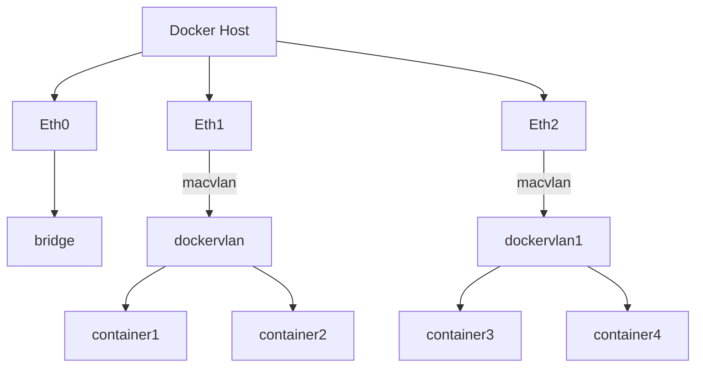

# Documentation
> Make sure you already download docker, docker-compose  and git

This repository for docker wordpress with php ldap module, mysql, phpmyadmin and redis cache. Also wordpress using 2 network bridge to communicate with other container same network in docker compose and macvlan to communicate outside network with dedicate ip address.

Here is network diagram for the container schema

## Step to Run

Download repository and enter working directory

    git clone https://github.com/dwinurhadia/macvlan.git
    cd macvlan

> please make sure you don't have same exposing port in same docker host and also ip address available

Make 2 folder for db and wordpress document

    mkdir db_data wordpress_data
    chmod -R 777 db_data

Build Dockerfile to image

    docker-compose build

Running Docker Compose

    docker-compose up -d
Wait for a few min then open your ip address wordpress container in browser

    ex: http://10.55.254.33:80
    
To open phpmyadmin, please open docker host ip and port expose by phpmyadmin

    ex: http://10.55.254.126:8011

## Custom php module

To add custom php config just put your config .ini in `php_custom` folder

> Need attention!

### Issue 1

If we define same name in macvlan network docker-compose

    ERROR: Network "dockervlan" needs to be recreated - option "parent" has changed

To fix this, you need change different name of `network name`

### Issue 2

If we have multiple docker-compose file running on same docker-host. Make sure new docker-compose is getting in `different ip pool network`. In example you define `10.55.254.200/32` it will make another docker-compose file cannot access internet or getting some error when start

    root@881b220c6ced:/var/www/html# ip a | grep inet
        inet 127.0.0.1/8 scope host lo
        inet 192.168.16.5/20 brd 192.168.31.255 scope global eth1
        inet 10.55.208.201/24 brd 10.55.208.255 scope global eth0
    root@881b220c6ced:/var/www/html# ping google.com
    PING google.com (172.217.194.100) 56(84) bytes of data.
    From 881b220c6ced (10.55.208.201) icmp_seq=1 Destination Host Unreachable
    From 881b220c6ced (10.55.208.201) icmp_seq=2 Destination Host Unreachable
    From 881b220c6ced (10.55.208.201) icmp_seq=3 Destination Host Unreachable
    ^C
    --- google.com ping statistics ---
    5 packets transmitted, 0 received, +3 errors, 100% packet loss, time 4090ms
    pipe 4
    root@881b220c6ced:/var/www/html#

You need to increase `ip_range` pool to make sure multiple container join in same network. 

### Issue 3

You can ignore if you shutdown docker-compose file still getting error warning

    d@nginx:~/$ docker-compose down
    Stopping pma       ... done
    Stopping wordpress ... done
    Stopping mysql     ... done
    Stopping redis     ... done
    Removing pma       ... done
    Removing wordpress ... done
    Removing mysql     ... done
    Removing redis     ... done
    Removing network wp_backend
    Removing network dockervlan
    ERROR: error while removing network: network dockervlan id 122371046f4ad87edcd7f445fd6cdc0c67c2cbe11556e6b99c3c1a774387bf8c has active endpoints

This happen because another docker-compose join with same macvlan network

### Issue 4

Same network macvlan and same ip_range

    d@nginx:~/wp-208-1$ docker-compose up -d
    Creating network "wp-208-1_backend" with driver "bridge"
    Creating network "vlan208" with driver "macvlan"
    ERROR: Pool overlaps with other one on this address space

The error you are encountering is suggesting you have a network address conflict. To check that you could run: `docker network ls` to list all the docker network running currently on your machine.
Please change `ip_range` to different pool

### Issue 5

Multiple network macvlan in same network and different pool will getting an error

    d@nginx:~/test2$ docker-compose up -d
    Creating network "dockervlan1" with driver "macvlan"
    ERROR: failed to allocate gateway (10.55.212.1): Address already in use
    d@nginx:~/test2$

## Solution

### Case 1

If we have multiple container with same network macvlan, make sure you `have same network macvlan, and different subnet ip_range`

Container 1

    networks:
      backend:
        driver : bridge
    
      dockervlan:
        name: dockervlan
        driver: macvlan
        driver_opts:
          parent: eth1
        ipam:
          config:
            - subnet: "10.55.212.0/24"
              ip_range: "10.55.212.8/29" 
              gateway: "10.55.212.1" 

Container 2

    networks:
      backend:
        driver : bridge
    
      dockervlan:
        name: dockervlan
        driver: macvlan
        driver_opts:
          parent: eth1
        ipam:
          config:
            - subnet: "10.55.212.0/24" 
              ip_range: "10.55.212.16/29"
              gateway: "10.55.212.1" 

### Case 2

You must add multiple interface or vlan to add multiple network macvlan in same dockerhost
List interface

    d@nginx:~/$ ifconfig | grep eth
    eth0: flags=4163<UP,BROADCAST,RUNNING,MULTICAST>  mtu 1500
            ether 00:15:5d:01:b6:27  txqueuelen 1000  (Ethernet)
    eth1: flags=4163<UP,BROADCAST,RUNNING,MULTICAST>  mtu 1500
            ether 00:15:5d:01:b6:33  txqueuelen 1000  (Ethernet)
    eth2: flags=4163<UP,BROADCAST,RUNNING,MULTICAST>  mtu 1500

List Network

    d@nginx:~/$ docker network ls
    NETWORK ID     NAME            DRIVER    SCOPE
    53ee875c1cc6   bridge          bridge    local
    dde4b07c021e   dockervlan      macvlan   local
    a4ca9d50367a   dockervlan1     macvlan   local
    a96a4a09b05b   host            host      local
    674e18cf6f16   none            null      local
    d@nginx:~/$

Here is mapping for the interface in same dockerhost
